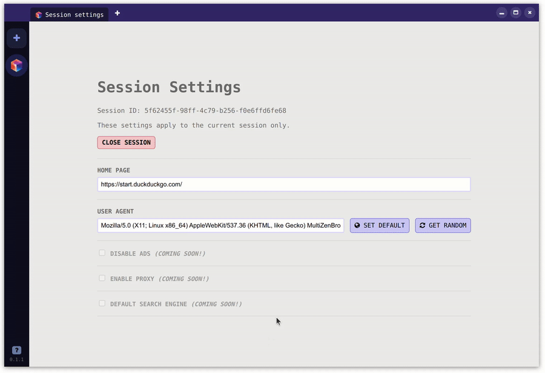

# MultiZen Browser

## Overview

Welcome to the MultiZen Browser project. This is an open-source multi-session browser, primarily designed for private browsing. It was developed out of a need for a substantial multi-session tool.

Check out the website: https://getmultizen.com/

## Features

- Create multiple sessions and tabs within each session (each session has own cookies, localStorage, etc)
- Assign a custom or random user-agent to each session.
- No activity tracking.
- Tech stack: Electron, Vue, Vuex.
- Supported OS: Windows, Linux, Mac OS.

## Getting Started

The project is built using Electron, Vue, and Vuex. To get started with development, follow these steps:

1. Clone the repository: `git clone https://github.com/multizenteam/multizen-browser.git`
2. Navigate to the project directory: `cd multizen-browser`
3. Install dependencies: `yarn install`
4. Start the development server: `yarn dev`

## Contribution

We welcome contributions of all kinds from the open-source community. Feel free to open an issue if you find a bug or have a feature request.

## Support

Join our [Discord server](https://discord.gg/pd6MhzPbJ3) for support and discussions.
